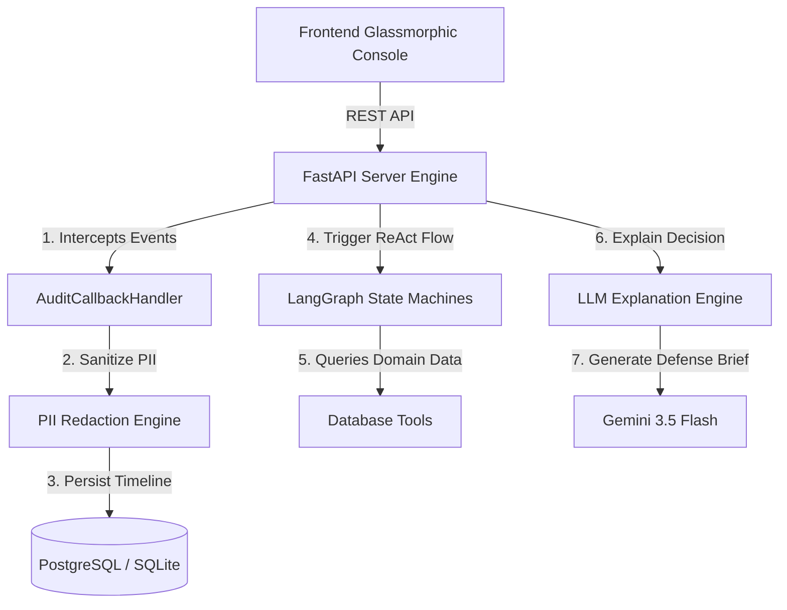

<div align="center">

# 🛡️ TraceGuard

### Enterprise AI Governance, Observability & Decision Path Auditor Layer
**Problem Statement 7.1 (Unit 7 — Audit Trails & Explainability)**

[](https://fastapi.tiangolo.com/)
[](https://python.langchain.com/)
[](https://ai.google.dev/)
[](https://www.postgresql.org/)
[](LICENSE)

[Architecture Overview](#-architecture) • [Key Features](#-key-features) • [Business Agents](#-enterprise-agents-suite) • [Quick Start](#-quick-start) • [AWS Deployment](#-aws-production-deployment) • [API Reference](#-api-documentation)

</div>

---

## 📌 Executive Summary

When autonomous AI agents make high-stakes operational decisions (underwriting a loan, denying employee leave, or rejecting a customer refund), standard application logs are insufficient for compliance. Plain console outputs fail because they:
1. **Lack Causal Traceability**: They do not capture intermediate tool arguments, observations, or the LLM's chain-of-thought.
2. **Leak PII**: They store raw emails, phone numbers, and financial details into persistent log storage, violating GDPR/CCPA.
3. **Lack Explainability**: They cannot automatically synthesize non-technical summaries or legal defense letters for audit bodies (CFPB, DOL, FTC).

**TraceGuard** resolves these enterprise governance gaps by implementing an event-driven, agent-agnostic **Decision Path Auditor**. Built using a passive callback architecture, TraceGuard intercepts runtime reasoning steps, sanitizes PII before storage, persists relational timelines to PostgreSQL, and leverages Google Gemini 3.5 Flash to synthesize plain-English justifications and formal regulatory defense letters on demand.

---

## 🏗 System Architecture

TraceGuard uses a decoupled, event-driven topology separating UI, API routes, stateful LangGraph agent execution, interception callbacks, and relational persistence.



### Request Execution Sequence:
1. **Payload Ingestion**: FastAPI receives evaluation parameters and attaches a unique `session_id` (UUIDv4).
2. **Callback Interception**: `AuditCallbackHandler` extends LangChain/LangGraph event listeners to record `THOUGHT`, `TOOL_CALL`, and `TOOL_OUTPUT` events without modifying core agent code.
3. **PII Masking**: The redactor scans inputs and observations, sanitizing emails, phone numbers, and credit cards prior to SQL insertion.
4. **Relational Persistence**: Steps are stored in `decision_steps` under the parent `agent_sessions` entity in PostgreSQL.
5. **Explainability Synthesis**: Trace timelines are fed into Gemini 3.5 Flash to generate dynamic plain-English summaries and regulatory defense letters (CFPB / DOL / FTC).

---

## ✨ Key Features

- 🔌 **Agent-Agnostic Interception**: Zero modification required to core agent business logic. Attaches seamlessly to any LangGraph state machine.
- 🔒 **Zero-PII Storage Layer**: Automated regex masking of emails (`[REDACTED_EMAIL]`), phone numbers (`[REDACTED_PHONE]`), and financial card numbers (`[REDACTED_CREDIT_CARD]`) before DB write.
- 🏢 **Multi-Domain Enterprise Agents**: Three operational ReAct agents backed by database tables (Lending, HR Leave, Support Refund).
- ⚖️ **Dynamic Policy Rules Engine**: Configurable thresholds (credit caps, DTI limits, leave balances, return windows, fraud risk scores) evaluated at runtime.
- 📜 **Automated Regulatory Brief Generator**: Instant generation of legal compliance defense letters tailored to CFPB, DOL, and FTC regulatory frameworks.
- 🚀 **Production-Grade Cloud Topology**: Multi-database support (SQLite for dev, PostgreSQL for production) with containerized deployment scripts for AWS EC2 / Fargate.

---

## 💼 Enterprise Agents Suite

TraceGuard includes three production-ready, database-driven LangGraph business agents located in `app/agents/`:

| Agent Domain | Primary Entity / DB Tables | Tools Executed | Governance Criteria Evaluated |
|---|---|---|---|
| 💳 **Lending Underwriter** | `applicant_profiles` | `get_credit_profile`<br>`get_active_debts`<br>`get_income_profile` | • Credit Score $\ge 580$<br>• Employment Status = `Employed`<br>• Employment Length $\ge 1.0$ yr<br>• 0 Missed Payments (12m)<br>• Debt-to-Income (DTI) $\le 45\%$ |
| 🌴 **HR Leave Approver** | `employee_records`<br>`leave_records` | `get_employee_record`<br>`get_leave_balance`<br>`check_team_calendar` | • Employee Status = `Active`<br>• Requested Days $\le$ Balance<br>• Departmental Staffing Coverage $\ge 60\%$ |
| 🛒 **Support Refund** | `customer_accounts`<br>`order_records` | `get_customer_account`<br>`get_order_details`<br>`get_fraud_score` | • Account Status = `Active` (Trust Score $\ge 50$)<br>• Return Window $\le 30$ days<br>• Refund Amount $\le \$500$<br>• Fraud Risk Score $< 50$ |

---

## ⚡ Quick Start (Local Execution)

### Prerequisites
- Python 3.10+
- Git

### 1. Clone & Set Up Virtual Environment
```bash
git clone https://github.com/GopikaArumugam/TraceGuard.git
cd TraceGuard
python -m venv venv
source venv/bin/activate  # On Windows: venv\Scripts\activate
```

### 2. Install Dependencies
```bash
pip install -r requirements.txt
```

### 3. Environment Configuration
Create a `.env` file in the project root:
```env
DATABASE_URL=sqlite:///./audit_logs.db
GEMINI_API_KEY=your_gemini_api_key_here
API_KEY=super-secret-audit-key-99
```

### 4. Run Application Server
```bash
uvicorn app.main:app --reload
```
Open your browser at **`http://localhost:8000`** to access the interactive audit console!

---

## 🐳 Docker & Multi-Container Setup

To test in a production-identical environment backed by PostgreSQL:

```bash
# Spin up FastAPI application and PostgreSQL 15 containers
docker-compose up --build
```
The system will automatically initialize PostgreSQL schemas and seed the initial dataset on first boot!

---

## ☁️ AWS Production Deployment

TraceGuard is deployed on an **AWS EC2 Ubuntu 24.04 LTS** instance backed by **PostgreSQL 15**:

```bash
# 1. SSH into AWS Instance
ssh -i "auditor-key.pem" ubuntu@<EC2_PUBLIC_IP>

# 2. Provision Dependencies & PostgreSQL
sudo apt update && sudo apt install -y python3-pip python3-venv postgresql git
sudo -u postgres psql -c "CREATE DATABASE audit_db;"
sudo -u postgres psql -c "CREATE USER db_admin WITH PASSWORD 'YourStrongPassword';"
sudo -u postgres psql -c "GRANT ALL PRIVILEGES ON DATABASE audit_db TO db_admin;"
sudo -u postgres psql -d audit_db -c "ALTER SCHEMA public OWNER TO db_admin;"

# 3. Clone Repository & Launch Production Daemon
git clone https://github.com/GopikaArumugam/TraceGuard.git
cd TraceGuard
python3 -m venv venv && source venv/bin/activate
pip install -r requirements.txt
sudo venv/bin/uvicorn app.main:app --host 0.0.0.0 --port 80
```

---

## 📖 API Documentation

The server exposes OpenAPI compliant REST endpoints:

| Endpoint | Method | Description |
|---|---|---|
| `/agent/run` | `POST` | Triggers evaluation run for target agent (`loan`, `hr`, or `refund`) with full audit callbacks |
| `/audit/sessions` | `GET` | Queries historical audit sessions with user, status, and timestamp filtering |
| `/audit/session/{session_id}` | `GET` | Returns full chronological timeline trace (inputs, thoughts, tool calls, verdicts) |
| `/audit/session/{session_id}/explain` | `GET` | Synthesizes plain-English customer justification |
| `/audit/session/{session_id}/challenge-response` | `GET` | Synthesizes formal regulatory defense letter for CFPB / DOL / FTC compliance |

---

## 🧪 Testing Suite

Run the automated Pytest test suite covering PII redaction and agent execution:

```bash
python -m pytest
```

---

<div align="center">

Made for **Enterprise AI Governance & Decision Transparency** • Powered by **LangGraph & Google Gemini**

</div>
