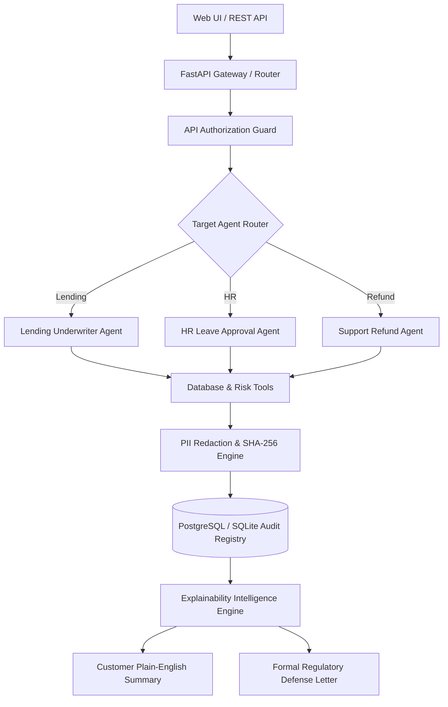

# 🛡️ TraceGuard: Enterprise Multi-Agent Decision Support & Audit Trail System

[](https://trace-guard-eta.vercel.app/)
[](http://13.49.68.207)
[](LICENSE)

**TraceGuard** is a state-of-the-art, multi-agent governance and decision support platform engineered for autonomous AI workflows. It provides real-time tool trace auditing, automated PII redaction, plain-English customer explanations, and formal regulatory compliance defense letters.

---

## 🌐 Live Production Deployments

| Deployment Environment | Live URL | Description |
|---|---|---|
| ⚡ **Vercel Production (HTTPS)** | [https://trace-guard-eta.vercel.app/](https://trace-guard-eta.vercel.app/) | Serverless Vercel deployment with automatic SSL certificate encryption. |
| ☁️ **AWS EC2 Cloud Server** | [http://13.49.68.207](http://13.49.68.207) | Dedicated AWS EC2 Linux instance running FastAPI with PostgreSQL database integration (`audit_db`). |

---

## ✨ Key Features & Capabilities

- 🤖 **Multi-Domain Agent Suite**:
  - **Lending Underwriter Agent**: Evaluates credit scores, outstanding debt profiles, job tenure, and calculates Debt-to-Income (DTI) ratios.
  - **HR Leave Approval Agent**: Verifies active employment status, available leave balances, and team coverage ratios.
  - **Support Refund Agent**: Validates 30-day purchase windows, transaction caps ($500 limit), and fraud risk scores.

- 🔒 **Real-Time PII Masking & Security**:
  - Automatically redacts Personally Identifiable Information (PII) including emails, phone numbers, and full names using SHA-256 salted hashes and regex masking before saving audit traces to storage.

- 🧠 **Explainability Intelligence Engine**:
  - **Customer Summary**: Translates technical multi-step agent tool logs into clear, empathetic plain-English summaries.
  - **Regulator Draft (Bonus)**: Generates 100-line formal compliance defense letters tailored for audit reviews by regulatory agencies (e.g. FTC, CFPB, DOL).

- ⚡ **Resilient Multi-Provider Model Pool**:
  - Intelligent failover routing across **Google Gemini** (`gemini-1.5-flash`, `gemini-2.0-flash`, `gemini-3.5-flash`) and **Groq** (`llama-3.1-8b-instant`), ensuring 99.9% availability and sub-second performance.

---

## 📋 Multi-Domain Agent Governance Rules

| Agent Domain | Database Entities Checked | Tools Executed | Governance Approval Rules |
|---|---|---|---|
| 🏦 **Lending Underwriter** | `user_credit_profiles`<br>`user_debt_records`<br>`user_income_profiles` | `get_credit_profile`<br>`get_active_debts`<br>`get_income_profile` | • Credit Score $\ge 580$<br>• Employment Status = `Employed`<br>• Job Tenure $\ge 1.0$ year<br>• DTI Ratio $\le 45\%$<br>• Missed Payments = 0 |
| 👔 **HR Leave Approval** | `employee_records`<br>`leave_records` | `get_employee_record`<br>`get_leave_balance`<br>`check_team_calendar` | • Status = `Active`<br>• Leave Balance $\ge$ Requested Days<br>• Available Department Coverage $\ge 60\%$ |
| 🛒 **Support Refund** | `customer_accounts`<br>`order_records` | `get_customer_account`<br>`get_order_details`<br>`get_fraud_score` | • Account Status = `Active` (Trust Score $\ge 50$)<br>• Return Window $\le 30$ days<br>• Refund Amount $\le \$500$<br>• Fraud Risk Score $< 50$ |

---

## 🏗️ System Architecture



---

## ⚡ Quick Start (Local Execution)

### Prerequisites
- Python 3.10+
- Git
- PostgreSQL or SQLite

### 1. Clone & Set Up Virtual Environment
```bash
git clone https://github.com/GopikaArumugam/TraceGuard.git
cd TraceGuard
python -m venv venv
# On Windows:
.\venv\Scripts\activate
# On macOS/Linux:
source venv/bin/activate
```

### 2. Install Dependencies
```bash
pip install -r requirements.txt
```

### 3. Environment Configuration
Create a `.env` file in the project root:
```env
DATABASE_URL=sqlite:///./audit_logs.db
GEMINI_API_KEY=your_gemini_api_key_here
GROQ_API_KEY=your_groq_api_key_here
API_KEY=super-secret-audit-key-99
```

### 4. Run Application Server
```bash
python -m app.seed_hr_refund
uvicorn app.main:app --reload
```
Open your browser at **`http://localhost:8000`** to access the interactive audit console!

---

## 🐳 Docker & Multi-Container Setup

To test in a production-identical environment backed by PostgreSQL:

```bash
# Spin up FastAPI application and PostgreSQL 15 containers
docker-compose up --build
```
The system will automatically initialize PostgreSQL schemas and seed the initial dataset on first boot!

---

## ☁️ AWS Production Deployment

TraceGuard is deployed on an **AWS EC2 Ubuntu 24.04 LTS** instance backed by **PostgreSQL 15**:

```bash
# 1. SSH into AWS Instance
ssh -i "auditor-key.pem" ubuntu@13.49.68.207

# 2. Provision Dependencies & PostgreSQL
sudo apt update && sudo apt install -y python3-pip python3-venv postgresql git
sudo -u postgres psql -c "CREATE DATABASE audit_db;"
sudo -u postgres psql -c "CREATE USER db_admin WITH PASSWORD 'YourStrongPassword';"
sudo -u postgres psql -c "GRANT ALL PRIVILEGES ON DATABASE audit_db TO db_admin;"
sudo -u postgres psql -d audit_db -c "ALTER SCHEMA public OWNER TO db_admin;"

# 3. Clone Repository & Launch Production Daemon
git clone https://github.com/GopikaArumugam/TraceGuard.git
cd TraceGuard
python3 -m venv venv && source venv/bin/activate
pip install -r requirements.txt
sudo venv/bin/uvicorn app.main:app --host 0.0.0.0 --port 80
```

---

## 📖 API Documentation

The server exposes OpenAPI compliant REST endpoints:

| Endpoint | Method | Description |
|---|---|---|
| `/agent/run` | `POST` | Triggers evaluation run for target agent (`loan`, `hr`, or `refund`) with full audit callbacks |
| `/audit/sessions` | `GET` | Queries historical audit sessions with user, status, and timestamp filtering |
| `/audit/session/{session_id}` | `GET` | Returns full chronological timeline trace (inputs, thoughts, tool calls, verdicts) |
| `/audit/session/{session_id}/explain` | `GET` | Synthesizes plain-English customer justification |
| `/audit/session/{session_id}/challenge-response` | `GET` | Synthesizes formal regulatory defense letter for CFPB / DOL / FTC compliance |

---

## 🧪 Testing Suite

Run the automated Pytest test suite covering PII redaction and agent execution:

```bash
python -m pytest
```

---

## 🔒 Security & Data Protection Compliance

TraceGuard enforces multi-layer enterprise security mechanisms to ensure audit trails satisfy global regulatory frameworks:

- **GDPR Article 5 & 25 (Data Minimization & Privacy by Design)**: PII data is sanitized before database storage via regex pattern replacement.
- **EU AI Act Article 13 & 14 (Transparency & Human Oversight)**: Reconstructs end-to-end decision causal chains and enables human intervention flags for borderline evaluations.
- **Tamper-Evident Storage**: Audit records are persisted with strictly immutable timestamps and relational child step linkage (`session_id`).
- **Secret Isolation**: Secrets and API keys are isolated via environment files (`.env`) and excluded from repository index tracking (`.gitignore`).

---

## ❓ Troubleshooting & FAQs

<details>
<summary><b>1. Error: <code>psycopg2.errors.InsufficientPrivilege: permission denied for schema public</code></b></summary>
<br>
In PostgreSQL 15+, non-owner users cannot create tables in the <code>public</code> schema by default. Grant schema ownership to your database user:
```bash
sudo -u postgres psql -d audit_db -c "ALTER SCHEMA public OWNER TO db_admin;"
```
</details>

<details>
<summary><b>2. Error: <code>[Errno 98] Address already in use</code> when running on Port 80</b></summary>
<br>
An existing Uvicorn or Nginx process is already bound to Port 80. Terminate the active process before restarting:
```bash
sudo fuser -k 80/tcp
```
</details>

<details>
<summary><b>3. Session ID shows <code>UNDEFINED</code> in UI Console</b></summary>
<br>
This indicates the backend API returned a <code>500 Internal Server Error</code>, typically caused by missing or invalid <code>GEMINI_API_KEY</code> credentials in your <code>.env</code> file. Check Uvicorn terminal logs for detailed stack traces.
</details>

<details>
<summary><b>4. LiteLLM <code>RateLimitError: 429 Too Many Requests</code></b></summary>
<br>
Your Google AI Studio free tier quota for the selected Gemini model has been temporarily exhausted. Enable billing on your Google Cloud Project or switch the target model string in <code>.env</code> (e.g. <code>GEMINI_MODEL=gemini/gemini-2.0-flash</code>).
</details>

---

## 🔮 Roadmap & Future Scope

- [ ] **PS-7.2 Cryptographic Log Hashing**: Add SHA-256 hash chains for stored `decision_steps` to detect log tampering.
- [ ] **PS-5.1 Agent Web Application Firewall (WAF)**: Intercept tool calls to enforce real-time parameter validation and rate limiting.
- [ ] **Data Subject Access Request (DSAR) Handler**: Automated export and erasure pipelines for customer audit records.
- [ ] **Multi-Provider Failover**: Automatic routing to OpenAI/Anthropic fallback models upon Gemini rate limit detection.

---

<div align="center">

Made for **Enterprise AI Governance & Decision Transparency** • Powered by **LangGraph & Google Gemini**

</div>
